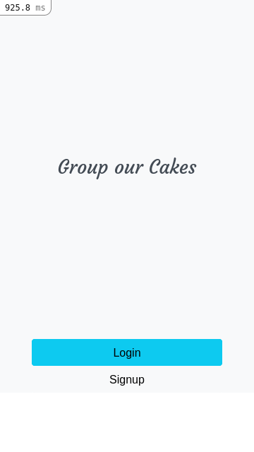
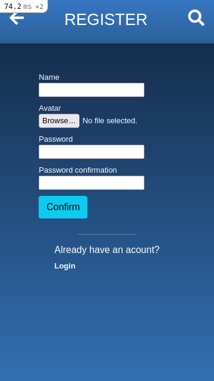
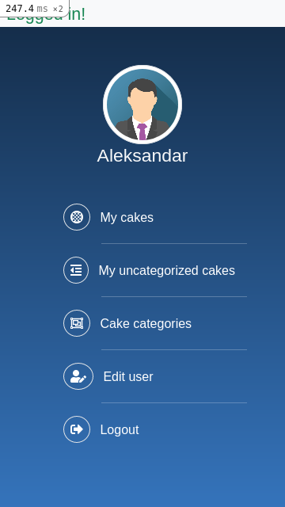

# Capstone project: Group our cakes app





> In this project I created mobile aplication for grouping cakes in diferent categories. Specification for this project you can find on [Project details](https://www.notion.so/Group-our-transactions-ccea2b6642664540a70de9f30bdff4ce#3c21fd71439d481e83b25b9cb8ecb8a8)

## Built With

- Ruby v2.7.2
- Ruby on Rails v6.1.4
- Bootstrap 5
- Sass

## Live Demo
[Live Demo Link](https://agile-lake-56047.herokuapp.com/)

## Getting Started

To get a local copy follow these simple example steps.

### Prerequisites

- Ruby: >2.6.3 
- Rails: >5.2.3 
- Postgres: >=9.5

### Setup

Clone the repository with:

```
git clone https://github.com/ShinobiWarior/Group-our-cakes.git
```
or just download [ZIP file](https://github.com/ShinobiWarior/Group-our-cakes/archive/refs/heads/development.zip)

Instal gems with:

```
bundle install
```

Setup database with:

```
   rails db:create
   rails db:migrate
```

### Usage

Start server with:

```
    rails server
```

Open `http://localhost:3000/` in your browser.

### Run tests

```
    rspec --format documentation
```

## Author

👤 **Aleksandar Ivezic**

- GitHub: [Aleksandar Ivezic](https://github.com/ShinobiWarior)
- Twitter: [@Aivezic](https://twitter.com/Aivezic)
- LinkedIn: [Aleksandar Ivezic](https://www.linkedin.com/in/aleksandar-ivezic/)


## 🤝 Contributing

Contributions, issues and feature requests are welcome!

Feel free to check the [issues page](https://github.com/ShinobiWarior/Group-our-cakes/issues/).

## Show your support

Give a ⭐️ if you like this project!

## Acknowledgments
This Project was inspired by Microverse and [Behance](https://www.behance.net/gallery/19759151/Snapscan-iOs-design-and-branding?tracking_source=) Design idea from [Gregoire Vella](https://www.behance.net/gregoirevella).
